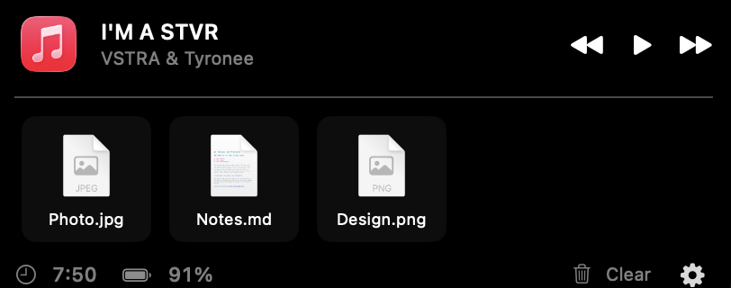

# NotchShelf

A native macOS menu-bar app that turns the MacBook notch into a **drag-and-drop
file shelf** with a **now-playing** strip and **system status** — a lightweight,
open-source take on the "dynamic island for Mac" idea.

Move your cursor to the notch and it expands downward; move away and it collapses.



## Features

- **File shelf** — drag files onto the notch to hold them, then drag them back out
  to Finder or any app. Dropped files are copied into private storage, so they
  survive even if the original is moved or deleted, and persist across relaunches.
  Right-click to **Share / AirDrop**, **Pin** (survives Clear), reveal, or remove;
  **Save All to Downloads** and a total-size readout in the footer.
- **Clipboard history** — a second tab keeps your recent copied text and images;
  click to re-copy or drag an entry straight out. In-memory only (never written to
  disk), and password-manager copies are ignored.
- **Now playing** — track, artist, artwork, transport controls, and a **seekable
  progress bar** for Music / Spotify; click the artwork to jump to the player.
- **System status** — battery level / charging state and a clock.
- **Hover to expand** — spring-animated dynamic-island-style open/close, plus a
  **⌘⌥N** global hotkey to toggle it.
- **Settings** — panel width, accent color, which sections to show, auto-clear
  timer for unpinned files, hotkey, and launch-at-login.
- **Background agent** — no Dock icon, lives in the menu bar; collapses to a
  click-through strip that never blocks the screen underneath.

## Install (download)

1. Download `NotchShelf.zip` from the [latest release](../../releases/latest) and unzip it.
2. Move **NotchShelf.app** to `/Applications`.
3. Because the app isn't notarized yet, the first launch is Gatekeeper-blocked.
   **Right-click the app → Open → Open**, or run once:
   ```bash
   xattr -dr com.apple.quarantine /Applications/NotchShelf.app
   open /Applications/NotchShelf.app
   ```
4. Look for the panel at the notch and the `▭` icon in the menu bar.
5. For the **Now Playing** strip, click **Enable** in the panel and allow the
   Automation prompt (or grant it later in *System Settings ▸ Privacy & Security
   ▸ Automation*).

## Requirements

- macOS 13 (Ventura) or later
- To build from source: Xcode 15+ (built and tested with Xcode 26) and
  [XcodeGen](https://github.com/yonaskolb/XcodeGen) (`brew install xcodegen`)

## Build & run

```bash
./build.sh run     # generate project, build, and launch
./build.sh         # build only
```

Or manually:

```bash
xcodegen generate
xcodebuild -project NotchShelf.xcodeproj -scheme NotchShelf \
  -configuration Debug -derivedDataPath ./build build
open ./build/Build/Products/Debug/NotchShelf.app
```

The app has no window of its own — look for the notch panel at the top of the
screen and the `▭` icon in the menu bar. On Macs without a physical notch, the
panel anchors to a synthetic band at the top-center of the main display.

## Project layout

```
Sources/
  App/      @main entry, AppDelegate, launch-at-login
  Notch/    panel window, geometry, shape, root view + view model
  Shelf/    file model + draggable cells (drop in / drag out)
  Media/    now-playing model + view
  Status/   battery/clock model + view
  Resources/Info.plist, asset catalog
```

The Xcode project is generated from `project.yml` and git-ignored — edit the YAML,
not the `.xcodeproj`.

## Notes & limitations

- **Now Playing** reads the current track from **Music** and **Spotify** via
  AppleScript and requires a one-time macOS **Automation** permission (the app
  requests it on first launch; click *Enable* / *Allow*). It does not yet cover
  browsers or other players — Apple locked down the system-wide MediaRemote API on
  macOS 15.4+, so universal now-playing would require the perl-based
  [`mediaremote-adapter`](https://github.com/ungive/mediaremote-adapter).
- The app is **not sandboxed** — this is what lets files drag back out to Finder
  reliably (the same approach NotchDrop uses). Sandboxing would require an
  `NSFilePromiseProvider` drag source instead.

## Prior art & references

Studied while building this: [DynamicNotchKit](https://github.com/MrKai77/DynamicNotchKit)
(MIT), [NotchDrop](https://github.com/Lakr233/NotchDrop) (MIT),
[boring.notch](https://github.com/TheBoredTeam/boring.notch) (GPL-3.0),
[Notchmeister](https://github.com/chockenberry/Notchmeister) (BSD-3). NotchShelf
is an independent implementation; see `LICENSE` (MIT).
